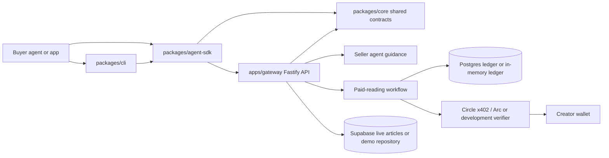
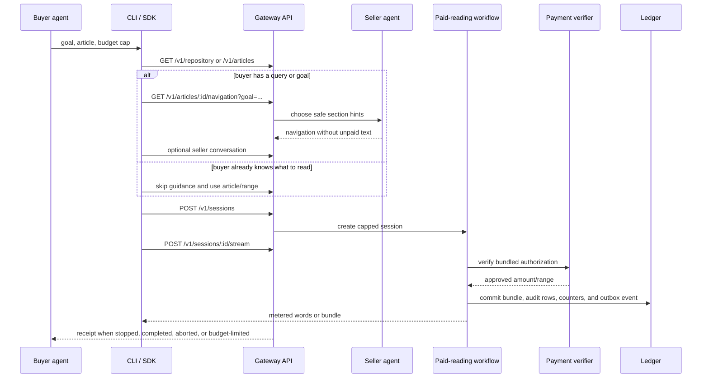
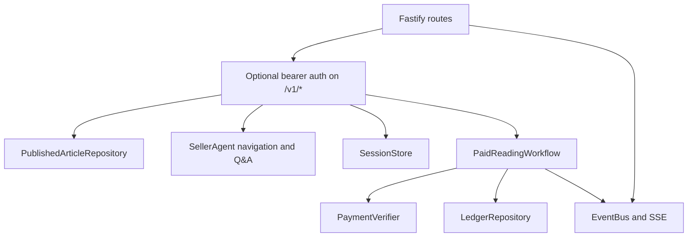
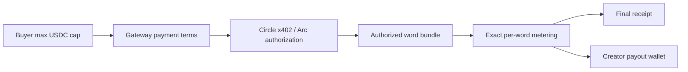

# Rubicon

Rubicon is backend infrastructure for AI agents to buy creator articles with
exact per-word USDC metering. A buyer agent opens a capped session, receives
only the words it is authorized to read, and gets a receipt for the exact words
delivered.

The seller agent helps the buyer find the right article section without leaking
paid content. The gateway, not the seller agent, controls paid word release,
budget enforcement, settlement, events, and receipts.

## What is in this repo

| Path | Purpose |
| --- | --- |
| `apps/gateway` | Fastify API for discovery, navigation, sessions, paid streaming, payment verification, persistence, and SSE events. |
| `packages/core` | Shared protocol, API contracts, pricing, money, network, and session primitives. |
| `packages/agent-sdk` | Buyer SDK that runs discovery, seller guidance, session creation, payment authorization, streaming, aborts, and receipts. |
| `packages/cli` | `rubicon` terminal client built on the SDK, including autonomous `buy`, discovery, config, Circle readiness, and local receipts. |
| `examples/agent-client` | Minimal local buyer-agent example. |
| `docs` | Deeper protocol, CLI, architecture, and local testing notes. |

Creator auth, article CRUD, wallet settings, and dashboard UI live in the
separate
[rubicon-marketing](https://github.com/michaelzoub/rubicon-marketing) app. This
repo reads public creator/article data and owns runtime sessions, payments,
deliveries, receipts, and buyer-facing clients.

## Architecture





## How reading works

1. The buyer discovers articles through `GET /v1/repository` or
   `GET /v1/articles`.
2. If the buyer has a question or goal, it can ask navigation endpoints or the
   seller conversation API for a safe section recommendation.
3. The buyer opens `POST /v1/sessions` with a hard USDC cap.
4. Paid articles return authorization terms. Free articles use the same session
   surface with `accessMode: "free"` and need no payment authorization.
5. The preferred delivery path is
   `POST /v1/sessions/:sessionId/stream`, which authorizes and delivers bundled
   words by default.
6. The gateway meters exact words, records payment detail, emits SSE events at
   `GET /v1/sessions/:sessionId/events`, and returns receipts.
7. Buyers can stop early with a stop condition or
   `POST /v1/sessions/:sessionId/abort`.

The legacy `POST /v1/sessions/:sessionId/payments` route remains available for
explicit one-word payment/debugging flows.

## Gateway internals



The gateway requires `APP_ENV=development|staging|production` and chooses its
runtime adapters from one environment profile. Development uses unprefixed
variables; staging and production use only `STAGING_*` and `PRODUCTION_*`
resource variables. The full variable matrix and fail-closed isolation rules are
in [docs/environments.md](docs/environments.md).

| Concern | Production path | Local/demo path |
| --- | --- | --- |
| Articles | Supabase public/live articles | `RUBICON_ARTICLES=demo` in-memory article |
| Runtime data | `DATABASE_URL` Postgres ledger | In-memory ledger |
| Payments | `RUBICON_PAYMENTS=circle` Circle x402 / Arc verifier | Development verifier |
| Semantic search embeddings | `OPENROUTER_API_KEY` OpenRouter embeddings API | Lexical fallback search |
| API auth | `RUBICON_AGENT_API_KEY` bearer auth on `/v1/*` | unset for public local API |

Production analytics uses the transactional Postgres outbox and an optional
ClickHouse worker. Configure `ANALYTICS_ENABLED=true`, `CLICKHOUSE_URL`,
`CLICKHOUSE_USERNAME`, `CLICKHOUSE_PASSWORD`, `CLICKHOUSE_DATABASE`,
`ANALYTICS_BATCH_SIZE`, `ANALYTICS_FLUSH_INTERVAL_MS`,
`ANALYTICS_MAX_ATTEMPTS`, and `ANALYTICS_LEASE_TIMEOUT_MS`. ClickHouse is never
on the content-delivery transaction path. Operational details are in
[docs/bundle-ledger-and-analytics.md](docs/bundle-ledger-and-analytics.md).
That runbook includes the required expand/deploy/finalize sequence; applying
the ClickHouse SQL alone does not activate server ingestion.

## API surface

| Route | Purpose |
| --- | --- |
| `GET /health` | Public health check. |
| `GET /v1/endpoints` | Endpoint discovery. |
| `GET /v1/repository`, `GET /v1/articles` | List readable articles. |
| `GET /v1/articles/:articleId/navigation` | Safe navigation hints for a buyer goal. |
| `POST /v1/seller-agent/conversations` | Start seller-guided Q&A. |
| `POST /v1/seller-agent/conversations/:conversationId/messages` | Continue seller-guided Q&A. |
| `POST /v1/sessions` | Create a capped read session. |
| `POST /v1/sessions/:sessionId/stream` | Preferred bundled payment and delivery route. |
| `POST /v1/sessions/:sessionId/payments` | Legacy one-word payment route. |
| `GET /v1/sessions/:sessionId/payments` | Inspect payment requirements. |
| `GET /v1/sessions/:sessionId/events` | Observe typed server-sent events. |
| `POST /v1/sessions/:sessionId/abort` | Stop a session and finalize usage. |

## Quick start

Install dependencies:

```bash
pnpm install
```

Run the no-money local demo:

```bash
RUBICON_ARTICLES=demo \
RUBICON_PAYMENTS=development \
RUBICON_AGENT_API_KEY= \
DATABASE_URL= \
APP_ENV=development \
pnpm dev:gateway
```

In another terminal:

```bash
pnpm dev:cli -- buy --first --goal "find pricing" --max-usdc 0.10 --json
```

For live article reads, set Supabase environment values instead of
`RUBICON_ARTICLES=demo`:

```bash
cp .env.example .env
# Fill SUPABASE_URL and a Supabase service-role, anon, or publishable key.
pnpm dev:gateway
```

## Buyer SDK

```ts
import { RubiconClient, StaticPaymentEngine } from "@rubicon-caliga/agent-sdk";

const rubicon = new RubiconClient({
  paymentEngine: new StaticPaymentEngine(),
});

const receipt = await rubicon.run({
  articleId: "live-article-id-from-repository",
  goal: "Find the resale-fee clause",
  maxSpendAtomic: "20000",
  stopWhen: ({ text, wordsRead }) => wordsRead > 50 || /resale fee/i.test(text),
  onWord: (word) => process.stdout.write(`${word} `),
});

console.log("\nreceipt:", receipt);
```

`RubiconClient.run()` handles the full loop: repository/navigation, optional
seller guidance, session creation, payment authorization, bundled streaming,
stop conditions, aborts, and a final receipt.

## CLI

```bash
pnpm --filter @rubicon-caliga/cli build
pnpm dev:cli -- buy --first --goal "find pricing" --max-usdc 0.10 --json
pnpm dev:cli -- buy --first --goal "find pricing" --max-usdc 0.10 --granularity 10 --json
```

The CLI is a terminal-native wrapper around the SDK. It supports autonomous
buying, lower-level repository/search/article commands, Circle wallet readiness,
local config at `~/.rubicon/config.json`, and verified local receipts.

Buyers can choose `--granularity word|10|section|article`. Bundled reads emit
`article.bundle` events by default; explicit word mode emits `article.word`.

## Payments and receipts



The gateway fee defaults to **0 bps**. Creators receive the full per-word price,
excluding external network or payment-provider costs.

For real Circle / Arc payments:

1. Create and fund a Circle Agent Wallet.
2. Set `CIRCLE_API_KEY`, `CIRCLE_ENTITY_SECRET`, `CIRCLE_AGENT_WALLET_ID`, and
   `RUBICON_PAYMENTS=circle`.
3. Ensure each live article resolves to a verified creator wallet.
4. Set `CIRCLE_FACILITATOR_URL` for the target network.

## Persistence and deployment

Set `DATABASE_URL` to persist sessions, read bundles, optional word audits, payments, earnings, and
settlement receipts in Postgres:

```bash
APP_ENV=development DATABASE_URL=postgres://... pnpm --filter @rubicon-caliga/gateway migrate
```

Without `DATABASE_URL`, runtime data is in memory and disappears on restart.
Only articles with `state = live` are consumable by buyer agents in Supabase
mode.

The gateway binds `0.0.0.0:$PORT` or `0.0.0.0:$GATEWAY_PORT`. On Railway, keep
the service target port aligned with `PORT` and prefer the Supabase connection
pooler URL for `DATABASE_URL`.

## Development commands

```bash
pnpm build
pnpm lint
pnpm typecheck
pnpm test
pnpm dev:gateway
pnpm dev:agent
pnpm dev:cli
```

Gateway and many SDK/core tests execute compiled `dist` output, so run
`pnpm build` before `pnpm test` when validating code changes.

## Docs

See [docs/architecture.md](./docs/architecture.md),
[docs/server-endpoint-architecture.md](./docs/server-endpoint-architecture.md),
[docs/cli.md](./docs/cli.md), [docs/protocol.md](./docs/protocol.md), and
[docs/embeddings-contract.md](./docs/embeddings-contract.md) (the section-embedding
write contract owned by rubicon-marketing). To
test an unpublished SDK from another local agent project, use
[docs/local-agent-test.md](./docs/local-agent-test.md). For a public agent setup
file, use [skill.md](./skill.md).

If a change moves important routes, shared components, analytics, auth, imports,
payments, APIs, database schema, SDK exports, or dashboard structure, update
`.agents/skills/project-map/SKILL.md`.
