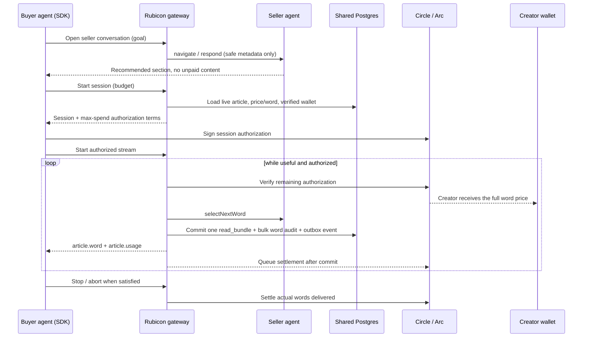

# Architecture

Rubicon is the backend infrastructure for pay-per-word content consumption by AI
agents. It connects:

- A **buyer agent** looking for information. It pays for every word it receives
  and can stop the moment it has enough.
- A **seller agent** representing a paywalled article. It lives server-side,
  understands the article's title, sections, body, author, and pricing, talks to
  buyer agents, recommends a starting section, and controls the paid stream.
- The **Rubicon gateway** that creates a Circle / Arc session authorization,
  meters words, releases only authorized content, settles actual usage, and
  records the ledger.
- The **creator wallet** that receives the full per-word price.

## Components

- **packages/core** — shared protocol types, word-level pricing math, session
  primitives, and the shared API contract used by rubicon-marketing.
- **apps/gateway** — the Fastify public agent API, seller agent, persistence
  adapters, and payment verifiers.
- **packages/agent-sdk** — the buyer-agent SDK (`RubiconClient.read()`).

## Persistence

Production data lives in shared Postgres, authored through
[rubicon-marketing](https://github.com/michaelzoub/rubicon-marketing). Rubicon
reads published articles, sections, creators, and verified wallets through
`PublishedArticleRepository`, and writes runtime activity
(`stream_sessions`, authoritative `read_bundles`, optional bulk
`word_deliveries`, compatibility `word_payments`, evidence-only `settlements`,
`settlement_bundle_links`, `analytics_outbox`, `seller_agent_messages`) through
`LedgerRepository`.

The marketing app owns creator authentication and creator-facing CRUD; Rubicon
does not implement a creator dashboard API. Development uses an in-memory adapter
with fixtures.

## Word-level integrity

- One word is one paid unit; one durable bundle records its immutable word range,
  exact per-word price, and aggregate amounts. Optional word audit rows are
  inserted in bulk.
- Payment authorization is session-level by default and chunk-level as a
  fallback. The network/payment layer should not run once per word in the normal
  Circle / Arc path.
- `word_deliveries` has a unique `(session_id, sequence)` constraint and a unique
  `idempotency_key`, so a word is never delivered or charged twice.
- Trusted values (price, wallet, creator, sequence, amount owed, recipient) are
  always loaded from persistent storage, never from buyer input.
- The gateway never emits a word unless the remaining authorization covers that
  word's price. Unused authorization is released when the buyer stops early or
  the session closes.

See [Bundle ledger, settlement lifecycle, and analytics](./bundle-ledger-and-analytics.md)
for the transaction boundary, migration audit, ClickHouse worker, and
reconciliation commands.

## Payment architecture

Rubicon separates metering from authorization:

- **Metering** remains word-level. This is the product contract, creator
  accounting model, and receipt format.
- **Authorization** is scoped to a session cap whenever possible. The cap comes
  from the buyer's explicit budget or predicted word count.
- **Settlement** is based on actual words delivered. A buyer can authorize
  20,000 atomic USDC, consume 7,300 atomic USDC of words, and settle 7,300.
- **Chunk fallback** authorizes multiple words at once when wallet policy,
  facilitator behavior, or demo constraints make a full-session cap
  unavailable. Chunk size is a risk knob, not the product unit.

This keeps the reading experience fast: the buyer signs once, words stream
smoothly, and the gateway enforces the authorized budget before every reveal.

## Seller agent

The seller agent is a first-class component with `navigate`, `respond`, and
`selectNextWord`. It uses a pluggable model/provider abstraction. A deterministic
development fallback ships for local runs with no model key — it is explicitly
development behavior, not the full production seller agent. The seller agent may
inspect private article content internally, but its unpaid outputs only ever
reveal safe navigation information.

## Fee policy

The Rubicon gateway fee is **0 basis points**. Creators receive the full per-word
price, excluding only unavoidable external network/payment-provider costs. The
`gatewayFeeBps` field remains in the protocol for forward compatibility but is
never advertised or calculated as nonzero.
