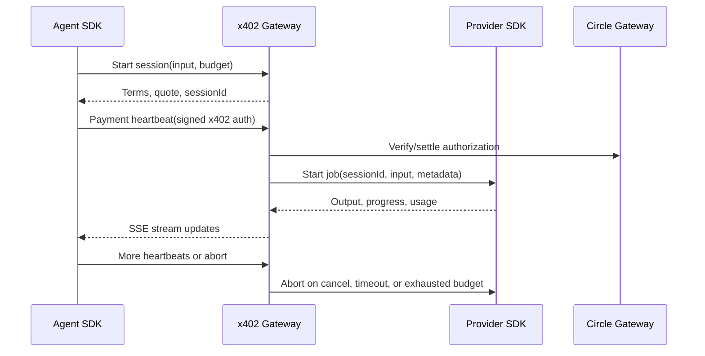

# Architecture

Rubicon has three actors:

- **Agent SDK**: creates sessions, signs/sends x402 payment heartbeats, receives output and status.
- **Gateway**: verifies payments, enforces budgets, routes work to providers, emits session updates, records usage and receipts.
- **Provider SDK**: accepts gateway-started jobs, emits output/usage/completion events, listens for abort or timeout.

The gateway is the control plane for session state, but it should not custody funds. Payment authorizations pass through to Circle Gateway settlement.

## Runtime Boundaries

- Agent-facing API: public HTTPS, x402-protected, session scoped.
- Provider-facing API: authenticated gateway-to-provider control and event callbacks.
- Payment adapter: owns Circle/x402 implementation details and can be swapped for test doubles.
- Ledger: records usage, payment authorizations, fee calculations, and settlement references.
