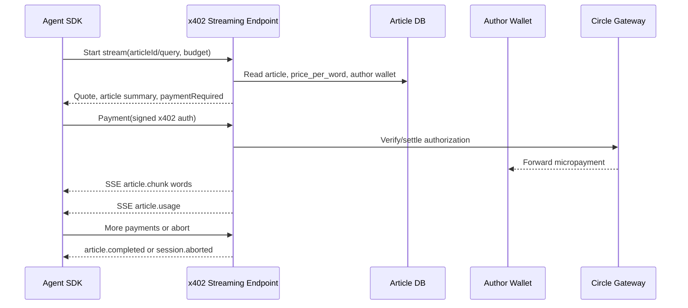

# Architecture

Rubicon has two runtime surfaces:

- **Agent SDK**: opens article streams, signs/sends x402 micropayments, receives word chunks and status.
- **Streaming Endpoint**: seller-side Fastify server that resolves articles, prices words, accepts micropayments, streams paid words, and records usage.

The endpoint is the control plane for stream state, but it should not custody funds. Payment authorizations pass through to Circle Gateway settlement for the author wallet.

## Runtime Boundaries

- Agent-facing API: public HTTPS, x402-protected, session scoped.
- Article registry: stores article content, `price_per_word`, caps, and author ownership.
- Author registry: maps author usernames to seller wallet addresses.
- Payment adapter: owns Circle/x402 implementation details and can be swapped for test doubles.
- Ledger: records words streamed, payment authorizations, fee calculations, and settlement references.
