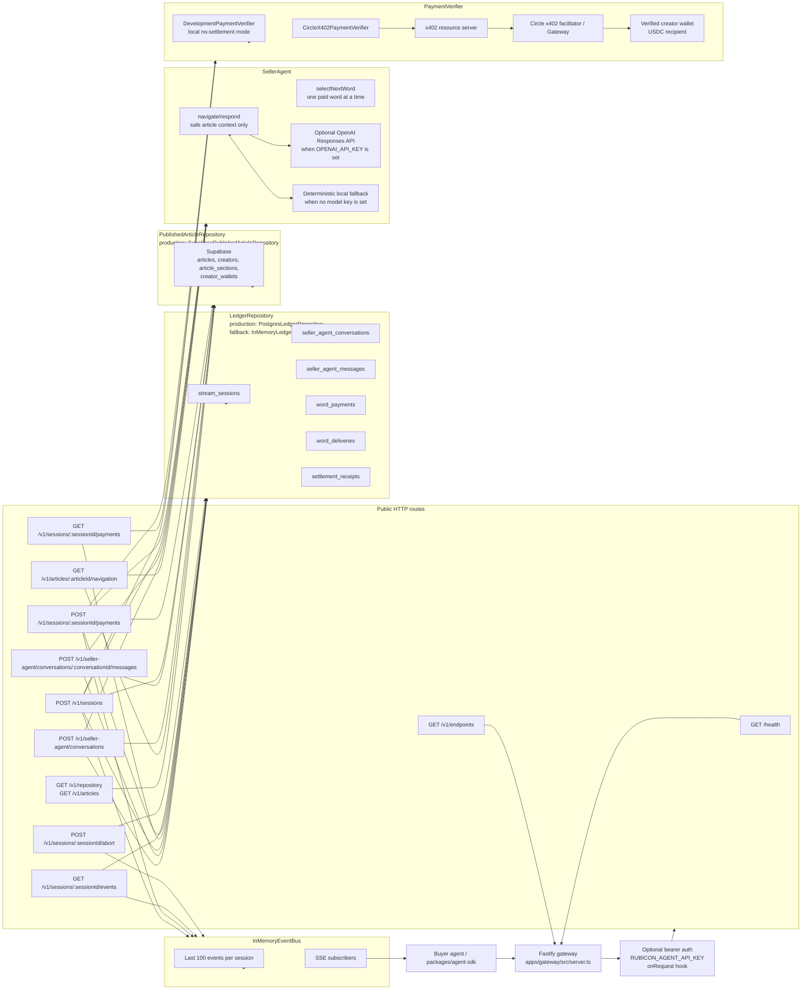
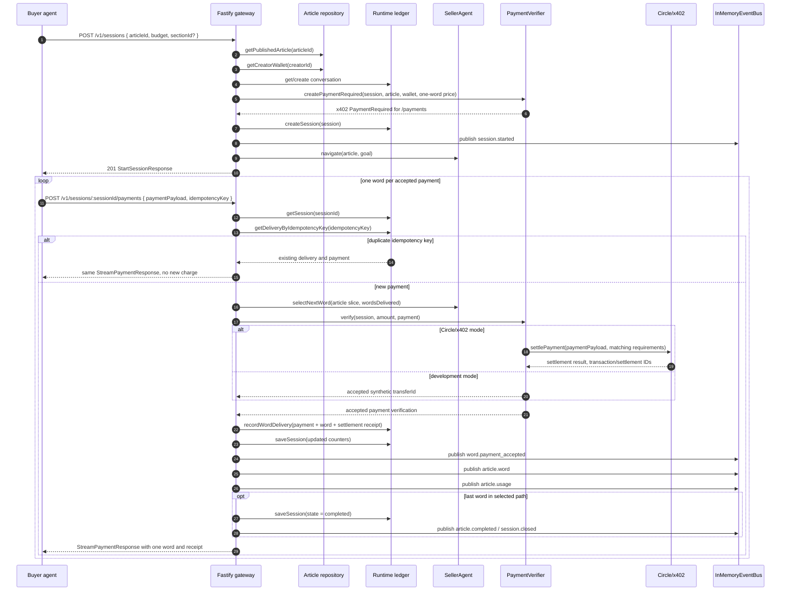

# Current Server Endpoint Architecture

This diagram reflects the current Fastify gateway in
`apps/gateway/src/server.ts` and its runtime wiring in `apps/gateway/src/index.ts`.
It focuses on the public `/v1/*` endpoints and how each route talks to storage,
seller-agent logic, payment settlement, and streaming events.

## Runtime Wiring

`apps/gateway/src/index.ts` creates the production server process:

- Article reads always use `SupabasePublishedArticleRepository`, configured from
  `SUPABASE_URL` and a service, anon, publishable, or public anon key.
- Runtime ledger writes use `PostgresLedgerRepository` when `DATABASE_URL` is set.
  Otherwise the gateway falls back to `InMemoryLedgerRepository`.
- Payments use `CircleX402PaymentVerifier` when `RUBICON_PAYMENTS=circle`.
  Otherwise they use `DevelopmentPaymentVerifier`.
- The seller agent uses OpenAI through `TextCompletionSellerModelProvider` when
  `OPENAI_API_KEY` is set. Otherwise it uses the deterministic local provider.
- All `/v1/*` routes require `Authorization: Bearer <RUBICON_AGENT_API_KEY>` when
  `RUBICON_AGENT_API_KEY` is configured. `GET /health` remains public.

## Endpoint Communication Map

| Endpoint | Primary job | Reads from | Writes to | Talks to |
| --- | --- | --- | --- | --- |
| `GET /health` | Liveness check | none | none | none |
| `GET /v1/endpoints` | Return static route index | static `ENDPOINTS` array | none | none |
| `GET /v1/repository`, `GET /v1/articles` | List live articles with safe metadata and payment terms | Supabase articles, sections, creators, verified wallets | none | none |
| `GET /v1/articles/:articleId/navigation` | Return article summary plus safe seller-agent navigation | Supabase article, sections, creator wallet | none | SellerAgent `navigate` |
| `POST /v1/seller-agent/conversations` | Create a seller-agent conversation and optionally run the first turn | Supabase article and wallet | `seller_agent_conversations`, optional `seller_agent_messages` | SellerAgent `navigate` and optional `respond` |
| `POST /v1/seller-agent/conversations/:conversationId/messages` | Continue an existing seller-agent conversation | Ledger conversation/messages, Supabase article | `seller_agent_messages` | SellerAgent `respond` |
| `POST /v1/sessions` | Start a budgeted reading session and issue a one-word payment requirement | Supabase article, sections, verified creator wallet, optional ledger conversation | `stream_sessions`, optional `seller_agent_conversations` | PaymentVerifier `createPaymentRequired`, SellerAgent `navigate`, InMemoryEventBus |
| `GET /v1/sessions/:sessionId/payments` | Inspect the current x402 payment challenge for a session | `stream_sessions` | may update session state to `expired` | Payment challenge response, InMemoryEventBus on expiry |
| `POST /v1/sessions/:sessionId/payments` | Verify or settle one payment, release exactly one word, record receipt | `stream_sessions`, idempotency records, article stream state or repository fallback | `word_payments`, `word_deliveries`, `settlement_receipts`, updated `stream_sessions` | PaymentVerifier `verify`, SellerAgent `selectNextWord`, InMemoryEventBus |
| `GET /v1/sessions/:sessionId/events` | Stream session events over SSE | `stream_sessions`, event history | none | InMemoryEventBus subscribe |
| `POST /v1/sessions/:sessionId/abort` | Stop an active session | `stream_sessions` | updated `stream_sessions` | InMemoryEventBus |

## Core Paid-Word Flow

## Safety and Integrity Boundaries

- Repository and navigation endpoints never expose article body text. They only
  return safe metadata: title, author, headings, section ranges, pricing, and
  seller-agent hints.
- `POST /v1/sessions/:sessionId/payments` decides the next word before
  settlement but only emits it after payment verification succeeds.
- Idempotency is enforced before state guards, so retried payment requests return
  the already released word instead of charging again.
- The ledger records payment and word delivery atomically in Postgres. The main
  uniqueness boundaries are the idempotency key and the session word sequence.
- Existing sessions can rebuild stream state from the article repository after a
  process restart. New sessions still require the article to be live.
- SSE events are in-memory only. They replay the last 100 events for a session to
  current process subscribers, but they are not durable across process restarts.
